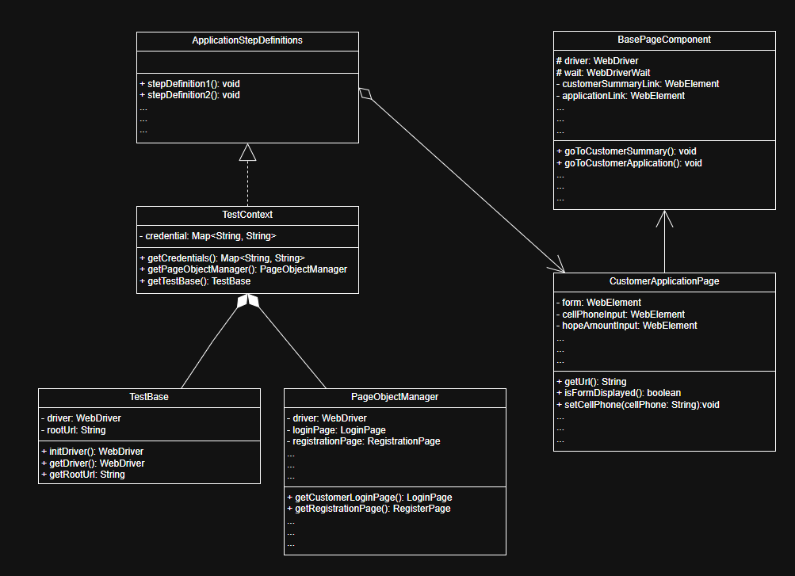

# Loan Service Testing Framework - BDD

## Overview
The Loan Service Testing Framework leverages Behavior-Driven Development (BDD) principles to simplify and enhance the testing process for loan-springboot-microservice. This framework integrates cutting-edge testing technologies like **Cucumber**, **Selenium**, and **TestNG**, ensuring a robust and scalable testing infrastructure.

---

## Technologies Used
### Cucumber
### Selenium
### TestNG

## Key Components
Here are the core classes and their roles:

### **PageObjectManager**
- Manages page objects to prevent redundant instantiations.
- Returns instances of different page objects on demand.

### **TestBase**
- Handles WebDriver initialization and configuration.
- Provides browser control.

### **TestContext**
- Acts as the central hub to:
    - Manages test context, including credentials and page object management.
    - have associations with TestBase and PageObjectManager.
  
- ### **BasePageComponent**
- A base class for all page objects.
- Contains navigation methods.

- ### **Page Objects(e.g. ManagerSummaryPage, ManagerCounselPage, etc)**
- Inherits BasePageComponent.
- Represents each page with specific functionalities

- ### **Step Definition Objects(e.g. AuthenticationStepDefinitions, ApplicationStepDefinitions, etc)**
- Defines Cucumber step definitions.
- Uses TestContext to interact with pages.

#### Dependency Injection:
`TestContext` is dependency-injected into step definitions using **PicoContainer**, allowing the same WebDriver and page objects to be shared across all step definitions.

## **Framework Diagram**

